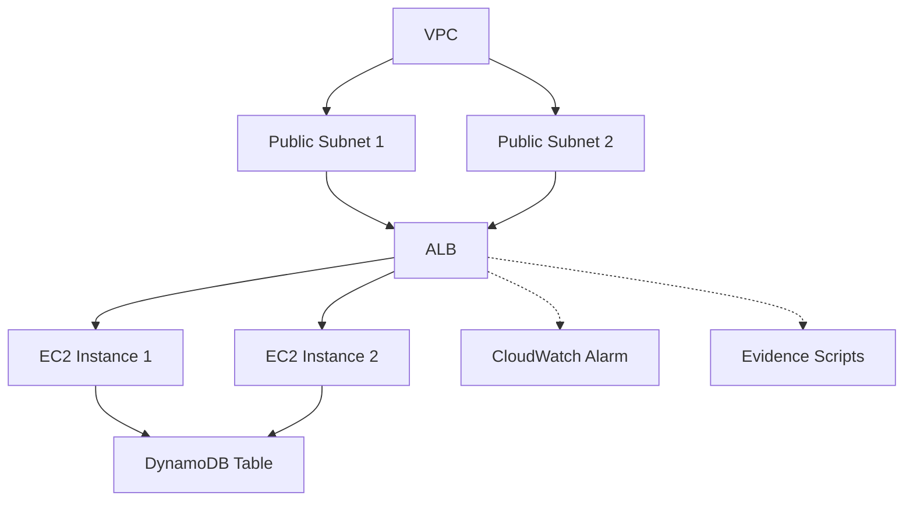

# High Availability Web Platform on AWS

**Automated, Secure, and Cost-Effective Cloud Solution for Real-World DevOps**

This project delivers a fully automated, secure, and cost-effective web platform on AWS, using Infrastructure as Code (CloudFormation and Terraform). It is designed to showcase advanced DevOps, cloud architecture, and automation skills, while remaining easy to understand for non-technical stakeholders.


## Overview

This repository provides a professional DevOps lab for deploying a highly available web platform on AWS using Infrastructure as Code (IaC) with both CloudFormation and Terraform. The solution is designed for security, automation, evidence collection, and cost control. All scripts and templates are written in English and follow best practices for clarity and reproducibility.

## Features

- Modular, secure CloudFormation (YAML) and Terraform (HCL) templates with detailed English comments
- Robust Bash scripts for deployment, destruction, verification, and evidence collection
- Unified, colorized, and professional CLI output for all scripts
- Environment variable export for seamless AWS CLI/manual use
- Automated evidence collection for compliance and troubleshooting
- Documentation focused on professional learning and safe operation in restricted AWS environments


## Architecture

The platform provisions the following AWS resources:

- VPC (Virtual Private Cloud) with two public subnets in separate Availability Zones
- Internet Gateway and public route table
- Application Load Balancer (ALB) for HTTP traffic
- Security Groups for ALB and EC2 instances (no public SSH open)
- Auto Scaling Group (ASG) with EC2 instances (Amazon Linux 2, free tier compatible)
- DynamoDB table for persistence
- CloudWatch Alarm for CPU utilization

All resources are tagged for traceability and cost allocation. EC2 instance names and tags are consistent and explicit (e.g., HaWebEc2Instance, HaWeb-Instance).

---

## Key Outputs

| Output Name            | Description                                      |
|------------------------|--------------------------------------------------|
| VPC ID                 | ID of the created VPC                            |
| Public Subnet 1 ID     | ID of the first public subnet (AZ1)              |
| Public Subnet 2 ID     | ID of the second public subnet (AZ2)             |
| ALB DNS Name           | DNS name of the Application Load Balancer        |
| ASG Name               | Name of the Auto Scaling Group                   |
| DynamoDB Table Name    | Name of the DynamoDB table                       |
| DynamoDB Table ARN     | ARN of the DynamoDB table                        |

---


## Architecture Diagram



---

## Usage Guide

1. Edit `.env.aws-lab` with your AWS credentials and parameters.
2. Install dependencies: `pip install -r requirements.txt` (for template validation and Python automation).
3. Deploy the infrastructure: `./scripts/deploy.sh` (full provisioning and outputs).
4. Verify the deployment: `./scripts/verify.sh` (status, outputs, troubleshooting).
5. Collect evidence: `./scripts/evidence.sh` (outputs, resources, audit in `evidence/`).
6. Destroy the infrastructure: `./scripts/destroy.sh` (full cleanup and cost control).
7. Manual AWS CLI usage: `set -a; . ./.env.aws-lab; set +a` (for advanced commands or troubleshooting).

---

## Solution Scope

- Networking: VPC, public subnets, IGW, route tables, network security.
- Compute: ALB, ASG, EC2, scalability and high availability.
- Persistence: DynamoDB (NoSQL), outputs and database evidence.
- Monitoring: CloudWatch Alarm, outputs and troubleshooting.
- Automation: Bash and Python for IaC, validation, evidence, and destruction.
- Security: Restrictive SGs, no public SSH, tagging, compliance.
- Cost: Free tier, outputs for control and automated destruction.
- Documentation: Comprehensive README, evidence, and formal explanation.

---


## Terraform Templates

All templates are available in this repository:

- [main.tf](./terraform/main.tf): Modular provisioning of network, compute, load balancer, auto scaling, DynamoDB, and robust outputs.
- [variables.tf](./terraform/variables.tf): Input variables for customizing environment, network, compute, and persistence.
- [outputs.tf](./terraform/outputs.tf): Exports all relevant IDs, names, and ARNs for integration and evidence.
- [user_data.sh](./terraform/user_data.sh): EC2 bootstrap script, displays metadata and environment on the web page.

**Implementation:**
The templates create a real HA architecture, with all resources and outputs needed to demonstrate mastery of the four AWS domains: networking, compute, persistence, automation, security, and cost control.

---

## AWS CLI Installation

This project does not require a bundled AWS CLI. Please install AWS CLI v2 using the official instructions:

- https://docs.aws.amazon.com/cli/latest/userguide/getting-started-install.html

All scripts and automation assume `aws` is available in your PATH. The `aws/` directory is not required and has been removed for clarity.

---


## Lessons Learned

- Security by design: no public SSH, least privilege, no hardcoded credentials.
- Reproducibility: IaC enables consistent and repeatable environments.
- Validation: linters and automated scripts catch errors early.
- Cost control: destruction instructions and free tier usage.
- Evidence and documentation: scripts and outputs for audit and learning.
- Flexibility: portable design between CloudFormation and Terraform.

---

## Future Improvements

- Add HTTPS and WAF for production environments.
- Further modularize scripts and templates.
- Integrate automated endpoint and persistence tests.
- Improve evidence collection (logs, metrics).
- Add integration examples with other AWS services (S3, Lambda, etc.).

---

## Quick Start

### 1. Configure Environment

Edit the `.env.aws-lab` file in the project root with your AWS credentials and parameters:

```
AWS_ACCESS_KEY_ID=your_access_key_id
AWS_SECRET_ACCESS_KEY=your_secret_access_key
AWS_SESSION_TOKEN=your_session_token
AWS_REGION=us-west-2
AMI_ID=ami-0c02fb55956c7d316
STACK_NAME=ha-web-platform
```

### 2. Install Python Requirements

Install the required Python package for template validation:

```bash
pip install -r requirements.txt
```

### 3. Deploy the Infrastructure

To deploy the full stack using CloudFormation:

```bash
./scripts/deploy.sh
```

This script will:
- Load environment variables from `.env.aws-lab`
- Validate the CloudFormation template
- Deploy the stack with the specified parameters
- Output the status and key resource information

### 4. Verify the Deployment

To verify the status and outputs of the deployed stack:

```bash
./scripts/verify.sh
```

This script will:
- Check the stack status
- Display outputs such as ALB DNS name and instance IDs

### 5. Collect Evidence

To collect evidence for compliance, auditing, or troubleshooting:

```bash
./scripts/evidence.sh
```

This script will:
- Gather CloudFormation events, stack outputs, and resource details
- Save all evidence in the `evidence/` directory

### 6. Destroy the Infrastructure

To safely delete all resources and avoid unnecessary costs:

```bash
./scripts/destroy.sh
```

This script will:
- Load environment variables
- Check stack state
- Delete the stack and confirm resource removal

## Manual AWS CLI Usage

To run AWS CLI commands manually with the correct environment variables loaded:

```bash
set -a; . ./.env.aws-lab; set +a
```

## Troubleshooting

- If the stack is in `ROLLBACK_COMPLETE` or `DELETE_FAILED` state, use the AWS Console or run:
  ```bash
  aws cloudformation describe-stack-events --stack-name $STACK_NAME --region $AWS_REGION --output table
  ```
- If you encounter missing dependencies, ensure you have `awscli` installed on your system.
- If credentials are not found, verify the `.env.aws-lab` file is present and correctly filled.
- AWS CLI version 2 is required for full compatibility.

## Security and Cost Control

- All scripts and templates are designed to avoid provisioning resources outside the lab scope
- No script modifies AWS credentials files directly
- Always destroy resources after use to prevent unnecessary charges

## Evidence and Compliance

- All deployment events, outputs, and resource details are saved in the `evidence/` directory after running `evidence.sh`
- This evidence is useful for audits, troubleshooting, and learning

## Authors

This project is created and maintained by SvillarroelZ and GitHub Copilot.

## License

MIT License


---

## Download Updated Templates

You can download the latest, production-ready infrastructure templates directly from this repository:

- [CloudFormation Template (main.yaml)](iac/main.yaml)
- [Terraform Main Configuration (main.tf)](terraform/main.tf)
- [Terraform Variables (variables.tf)](terraform/variables.tf)
- [Terraform Outputs (outputs.tf)](terraform/outputs.tf)
- [Terraform User Data Script (user_data.sh)](terraform/user_data.sh)

Simply right-click and save, or use the GitHub web interface to download the files for your own use, learning, or portfolio.

---

## Multi-IaC Coherence

This project provides both CloudFormation and Terraform templates that generate the exact same AWS architecture, outputs, and user experience. All scripts, outputs, and evidence collection are fully synchronized, making it easy to migrate, compare, or learn both tools in a professional context.

---

## Automated Evidence Collection

Evidence and outputs are collected automatically by dedicated scripts, regardless of whether you use CloudFormation or Terraform. This ensures that audits, troubleshooting, and documentation are always consistent and complete.

---

## No Unnecessary Dependencies

All automation relies on standard, well-documented tools (AWS CLI, Python, Bash). No custom binaries or local installers are required. The project is clean, portable, and easy to set up in any environment.

---

## AWS Cloud Practitioner Domains Coverage

| Domain                    | How This Project Delivers                                                                 |
|---------------------------|----------------------------------------------------------------------------------------|
| Cloud Concepts            | VPC, subnets, IGW, ALB, ASG, DynamoDB, CloudWatch, modular design, outputs, documentation|
| Security & Compliance     | Restrictive security groups, no public SSH, evidence scripts, tagging, cost control      |
| Technology                | Automation with Bash/Python, modular IaC, robust outputs, troubleshooting, monitoring    |
| Billing & Pricing         | Free tier resources, automated destruction, cost control, explicit outputs for tracking  |

---

